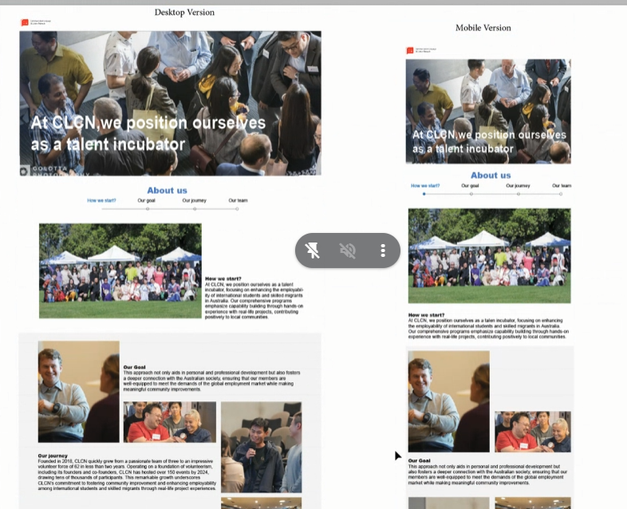
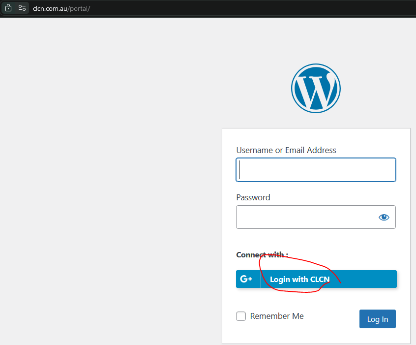

## Core ideas

- **Block theme over headless** A headless WordPress setup was considered and dropped: the language plugin wasn't compatible with it, and it would be hard to hand over to other developers. We stayed on a block theme and built pages with Kadence.
- **Templates over one-off pages** Programs, team members and events each got a reusable template, so new content could be added without designing a page from scratch.
- **Revisions as version control** WordPress page revisions served as our collaborative version control, and we backed the site up before rolling out design changes.

## Challenge

The site had to be redesigned and kept running at the same time, by a team that met weekly and whose members changed over time. Content came from other teams in English and Chinese, events were ticketed on Humanitix, and parts of the site, such as the media kit and internal tools, needed to be visible to members only.

## Approach

The team worked from Figma mockups of each page, desktop and mobile. I ran the weekly IT meetings and kept the minutes: each meeting reviewed what was done, then assigned the next tasks to a named person, usually with a one-week deadline. Once all the initial content was in, we split the work into two streams: maintenance and improvements of the website, and new features, each run as a separate project.

*The About Us page design, desktop and mobile.*

## How it works

### Pages and templates

Over the first months of 2024 the team rebuilt the header, footer and mobile menu, and the Home, About Us, Testimonials, Sponsors, Collaborators, Talent Incubation Program and Opportunities pages. I built the page frameworks for the new content, the Events screen, and a template for team member posts that the About Us page queries.

### Bilingual content

Switching between English and Chinese is handled by the TranslatePress plugin; the Chinese version of the content was translated in-house.

### Events and Humanitix

Events are ticketed on Humanitix. I integrated it with the site's event templates, and later the team built an automation that assembles event data and creates event posts in WordPress through its API, run with GitHub Actions. In 2025 the Events page was redesigned with filtering.

### Members-only access

I configured single sign-on with CLCN's Google Workspace, so members log in with their CLCN accounts through a "Login with CLCN" button. Pages like the media kit and the email signature generator are restricted to logged-in users.

*Single sign-on: members log in with their CLCN Google Workspace account.*

### The 2026 rebuild

The final iteration replaced WordPress with a [React app](https://github.com/COMMUNICATION-LANGUAGE-CULTURE-NETWORK/023d-wbfz-21fd-clcn-website) written in TypeScript and served by a small Express server, covering the About Us, Programs, Global Talent Incubator, CLP, Events, Opportunities and Impact pages. It's packaged with Docker and deployed to Google Cloud Run. I set up the deployment: on every push to `main`, GitHub Actions builds the image and deploys it, authenticating to Google Cloud through Workload Identity Federation, reusing the setup from our ERP project. I also added a route that redirects to the email signature generator.

## Setbacks

- **Snap scrolling** Full-page snap scrolling removed the page header and footer. After several weeks of troubleshooting, it was put on hold.
- **Photo gallery** A plugin that pulled photos into a WordPress gallery slowed the site down and wouldn't work with the event posting automation, so I disabled it.
- **Security** After the site was attacked, the login page was changed and unused accounts were removed. In 2025 we also enforced two-factor authentication.

## Outcome

The React version is live at [clcn.com.au](https://www.clcn.com.au).
