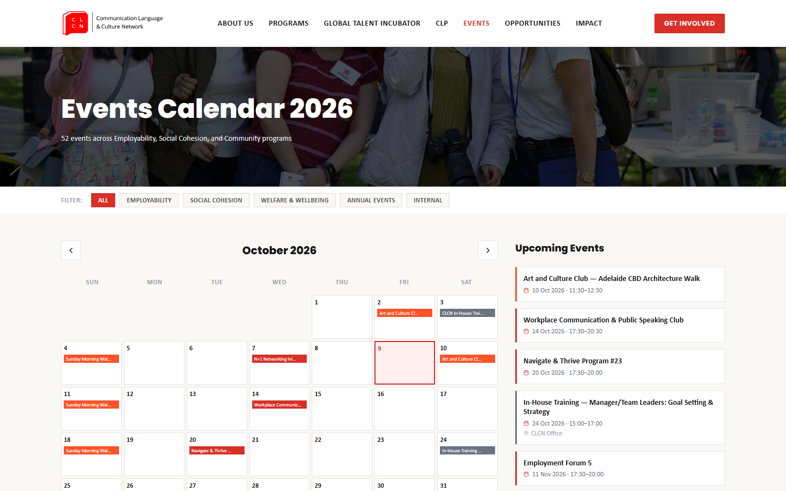

## Core ideas

- **Utility** is the thing we are making actually useful to end users?
- **Capabilities** what the team can realistically build and maintain with the skills and time it has. How can we manage team's long term as our skills improve?
- **Content management system** software with a separate management layer that doesnt require its re-deployment or significant effort to change user experience or serve additional information.
- **Change management** making changes without breaking things; making changes that are useful.
- **Management levels** Strategic: does the product allign with company's long term goals? Tactical: do capabilities and resources allign with requirements? Operational: does everyone knows what to do next and how?
- **Compromises**  adding more features serve the long-term goals but stretch resources and make goals uncertain; a better tool helps today's team but may be one the next team can't pick up.

## Challenge

In January 2024 the IT team was four volunteers meeting once a week, and the wishlist was ever-growing: a redesign that worked on mobile, English and Chinese versions, Humanitix ticketing, Salesforce data collection, analytics, a photo gallery that sorted photos by person, and an AI chatbot. The site had to stay live while we rebuilt it, and people joined and left the team every few months, so anything we built had to survive being handed over. Lastly the very same team was in charge of technical support and service delivery, so resources had to be managed cautiously. 

## Approach

**Start with no-code.** Leadership wasn't sure yet what a volunteer team could build and maintain, and no-code tools were the safe way to approach a new system. We considered moving to headless WordPress, but agreed to first try restyling the existing theme with custom CSS. Headless was then dropped altogether: the language plugin didn't work with it, and it would have been hard to hand over to the next developers. We stayed on a block theme with Kadence, and when a Figma design couldn't be built in Kadence, we simplified the design instead of fighting the tool.

**Make changes safely.** I ran the weekly meetings and kept the minutes: every task left the meeting with a name and, usually, a one-week deadline. Page revisions served as our version control, and I backed the site up before every design rollout. Once the initial content was in, we split the work into maintenance of the site and separate feature projects, so the site no longer needed the whole team.

**Cut what doesn't help visitors.** Not everything on the wishlist was worth keeping. The photo gallery plugin pulling photos directly from google drive slowed the site down and clashed with the event automation, so I disabled it. Full-page snap scrolling broke the header and footer - also removed.

**Service delivery** In mid-2025 we let branding team to manage posts themsleves. From then on, changes came in as change requests handled by small task groups formed as needed. 

**The cost of no-code.** It kept the site running, but it also set its limits. Every design was cut down to what the page builder and plugins could do, and the work developers did was mostly configuring them. That limit on  growth and creativity over time disincentivised them from active participation.

*The About Us page design, desktop and mobile.*

## How it works

### The WordPress site (2024–2025)

The first site ran on WordPress with a block theme, pages built in Kadence. Content lived in the CMS, with each reusable content type (page, post) having associated template that we prepared, so branding team could add pages and posts without designing them. 

TranslatePress switched the site between English and Chinese. Later we created automation to post event once they are published in Humanitix: a script run by GitHub Actions assembled the event data from Humanitix and posted it through the WordPress API. 

CLCN volunteers could log in with their CLCN Google Workspace accounts through a "Login with CLCN" button, which  content like signature generator and Learnin Management System running on LearnPress.

*The WordPress site: members log in with their CLCN Google Workspace account.*

### The transition

Eventually, the team had proved its technical capabilities and built alternative infrastrucure while working on the ERP porject in parallel. So we rebuilt the site from scratch: what we had spent two years on in WordPress took us less than a month in code. 

Surprisignly, our decision to ditch out sql database turned out well - we will likely never have enough stuff to store to make use of mysql. Instead we took static CMS approach where changes do require redeployment - this became much simpler as we learnt how to laverage build pipelines. With LLM tools, we also could shift perspective on who and how can contribute - bacause for website's puperoses mostly looks matter, the desired changes can be described by branding team straight to the agent. For more complex scenarios one of our IT members works in pair with them for more coplex bits that need integration like the calendar. 

### The React site (2026)

The [new site](https://github.com/COMMUNICATION-LANGUAGE-CULTURE-NETWORK/023d-wbfz-21fd-clcn-website) is a React app written in TypeScript and built with Vite and Tailwind, covering the Home, About Us, Programs, Global Talent Incubator, Events, Opportunities, Impact and Resources pages. A small Express server serves the built pages and handles one API route: contact forms, job applications and resource downloads all post to it, and it emails the details to CLCN. Events are kept as a list in the code and shown as a filterable calendar, each linking to its Humanitix registration page.

The deployment: on every push to `main`, GitHub Actions builds a Docker image tagged with the commit, pushes it to Google's registry and deploys it to Cloud Run, authenticating through Workload Identity Federation, so no keys are stored in GitHub. Cloud Run scales the site down to zero when nobody is visiting.

Last but not least, our initial Wordpress hosting costed us around $250 per year; the new setup without database costs us less than $2 per month. 

*The React site: the 2026 Events calendar, filtered by program and linked to Humanitix.*

## Outcome

The site is live at [clcn.com.au](https://www.clcn.com.au). 
