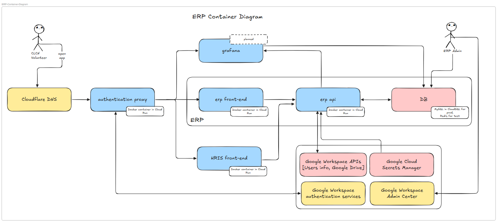
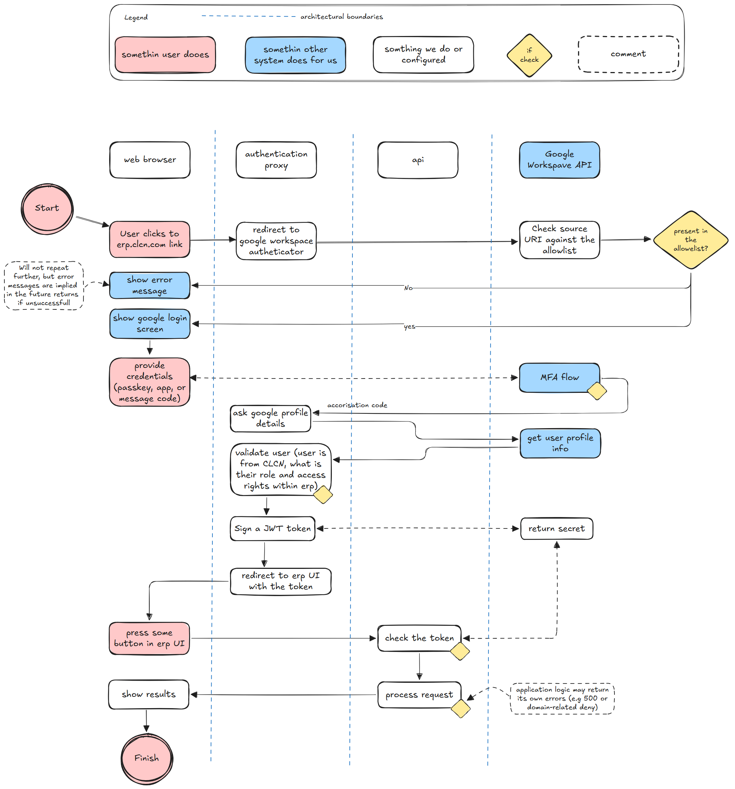
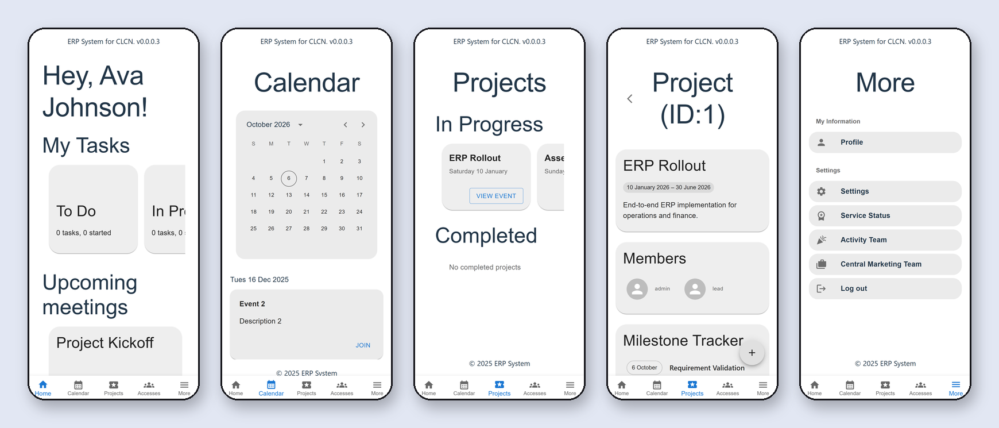
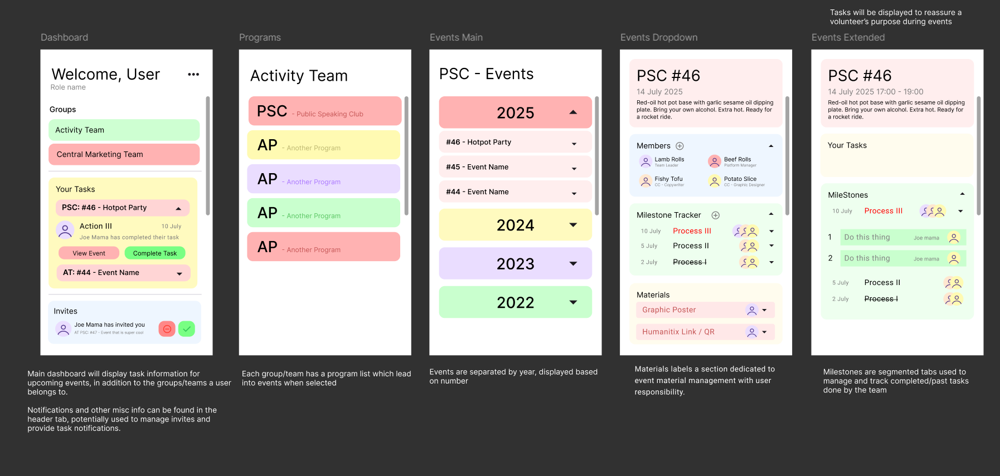

## Core ideas

- **Monorepo of containers** One repository holds the ERP front end, the HRIS front end, the API and an authentication proxy. Each is its own Docker container, deployed separately to Google Cloud Run.
- **Authentication at the edge** An authentication proxy sits in front of everything: users sign in with their CLCN Google Workspace account, and the proxy issues a signed token that the API checks on every request. The API is the trust boundary.
- **Domain first** Before building features, the domain was mapped with an event-storming session, and the API is organised by those domain entities: users, projects, processes, tasks, notifications and assets.

## How it works

### Architecture

Traffic goes through Cloudflare DNS to the authentication proxy, which routes to the ERP or HRIS front end. Both talk to the same API, backed by MySQL and Google Workspace APIs, with secrets kept in Google Cloud Secret Manager.

*Container diagram: the authentication proxy in front of the ERP and HRIS front ends, one API, MySQL, and Google services.*

### Sign-in

The proxy redirects to Google Workspace, checks that the user belongs to CLCN, signs a JWT and sends the user back to the app with it. The API then verifies that token on each request before processing it.

*Authentication flow across the browser, the proxy, the API and Google Workspace.*

### Delivery

Every push to the shared branches builds the containers and deploys them to Cloud Run through GitHub Actions. A separate test environment lets anyone check their branch in the cloud before merging into `dev`, and Docker Compose with a seeded local database covers local development.

### The ERP app

A mobile-first progressive web app: a home screen with the user's tasks and upcoming meetings, a calendar, projects with members and a milestone tracker, and more. It can be installed to a phone's home screen and updates itself when a new version is released.

*The ERP app: home, calendar, projects, a project's details, and the More menu (sample data).*

The screens started as designs in Figma, built around groups, programs and events, with tasks and milestones for each event.

*Design mockups from the team's Figma file.*

### The HRIS

Alongside the ERP, the same login and API serve an HRIS for volunteer recruitment and onboarding.
