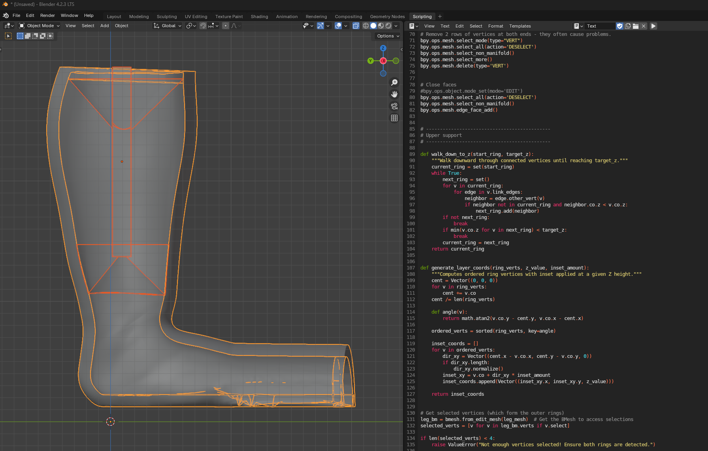
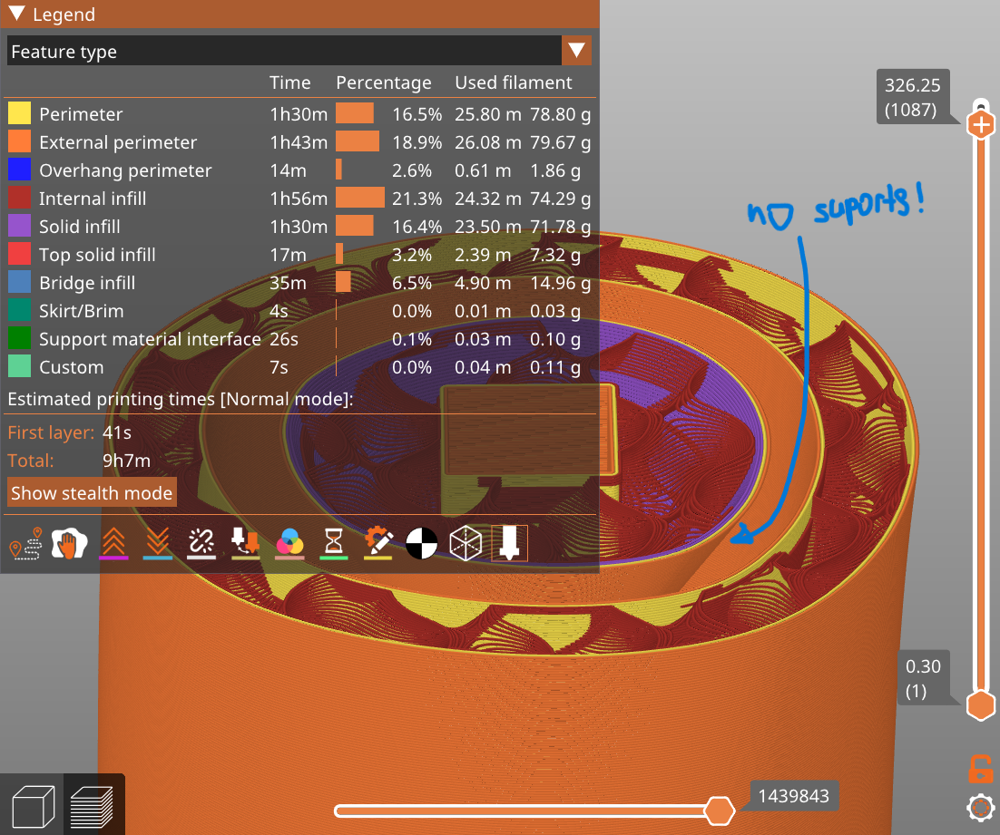

## Core ideas

- **Orthotic devices** Made to fit a person's body parts externally for physical support. To fit comfortably, these devices must be manufactured very precisely, based on 3D scans of the person's body part.
- **3D mesh modelling** Objects are represented as vertex graphs, each loop of 4 neighbouring vertices forming a face. Unlike CAD modelling, which defines the relative positions of vertices using constraints (and their corresponding mathematical relations), mesh modelling describes each vertex position independently, making it possible to describe more complex organic shapes.
- **Procedural modelling** Describing the modelling steps performed on a selected set of 3D objects in a programming language (or with visual tools like geometry nodes). Unlike generative modelling, which uses ML models, a defined procedure is deterministic: with a well-defined procedure, we know exactly what to expect for any given input.
- **Modifiers** Blender's way of imitating the parametric modelling common in CAD tools like Inventor. Each modifier is a layer of applied changes that can be further tuned.
- **Supports and infill** Most 3D printers can only build each layer on top of the one below. To print complex shapes with pronounced overhangs, slicer software automatically generates supporting structures, and fills the model's inside with infill. For larger models, this causes significant waste of material.

## How it works

### Automating the modelling stage

First, I had to master the manual modelling process formalised by other team members. Once I was comfortable with it, I used Blender's API to create a step-by-step routine that delivered an analogous result. The trickiest part was **handling model positioning**: a seemingly identical body part could differ dramatically in shape between people, and some scans were of the same body part but at different angles. The general technique I followed was creating simpler forms around the scans and detecting the exact coordinates where they intersect. Once the object and its relevant parts were successfully identified, non-destructive modifiers were applied step by step. This way, I could troubleshoot and check the result midway.

### Batch tool

The end result was a CLI tool that could be pointed at a folder of STL scans. It would then output a batch of models ready for the next step.

### Internal support structure

To optimise the material used, I developed an extra step that dynamically creates a **support structure inside the model**, which removes the need for most of the infill. To place it where needed, my script walked through the model ring by ring, calculating and comparing their vector divergence. Once the key points were calculated, a new object structure could be created around them. We spent a significant amount of time experimenting with how intersecting objects are represented once converted to G-code. With this knowledge, the final script could produce a unified structure consistently.

*The generated internal structure (orange) inside a leg orthotic, and the part of the script that walks down through the model's vertex rings.*

## Outcome

*The sliced model in PrusaSlicer: the internal structure prints without generated supports (support material is 0.1% of the print).*
