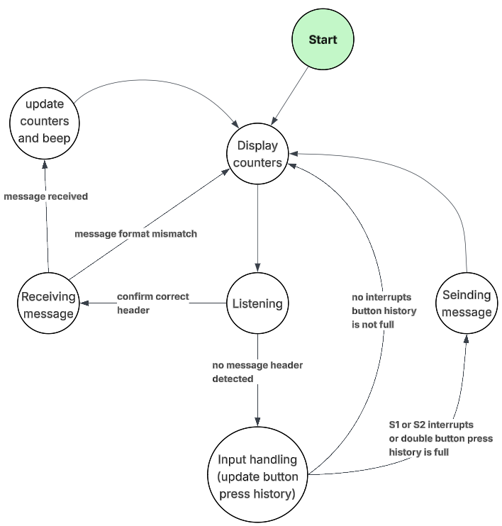
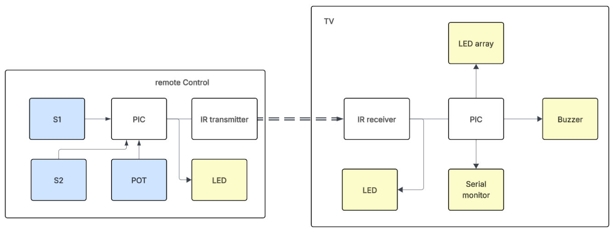

## Core ideas

- **Asynchronous communication** The two boards share no clock. The receiver has to pick out a message from the infrared signal on its own, using timing that both ends agree on in advance.
- **Framing** Each message is a frame: a header that announces it, the data, and a trailer. Anything that doesn't fit the frame is ignored.
- **Predefined codes** Every command is an 8-bit code known to both ends: one for each of volume down, volume up, channel down and channel up.
- **State machine** The system is a loop of states with a critical path that always runs, and branches taken only when there's a message to send or receive.

## Approach

I planned the system as a state transition diagram before writing the code. The same software was uploaded onto both subsystems: one acts as the remote and the other as the "TV". The critical path, display counters → listening → input handling, always runs unless a branch is taken to receive or send a message.



*State transition diagram for the remote control system.*

The physical diagram shows the two subsystems. Input devices are marked blue, the interfaces used to observe the system's behaviour are yellow, and arrows show where the signal travels.



*Physical diagram: the remote's buttons and potentiometer on the left, the TV's outputs on the right.*

Parts of the code came from earlier practicals: the bar graph and button handling from the encoder practical, and most of the infrared communication from the IR practical.

## How it works

### Display counters

At the start of every loop iteration, the TV shows the sound counter on its LED bar graph and prints both counters to the serial monitor.

```c
Bargraph(sound);
Serial.print("Sound Level: ");
Serial.print(sound);
Serial.print(" Channel: ");
Serial.print(channel);
Serial.println();
```

Every received message is confirmed with a beep, pitched from the code it carried, so different commands sound different.

### Input handling

The remote has two buttons, S1 and S2, and a potentiometer. A single press is caught by a hardware interrupt. Holding both buttons at once is detected with a history buffer: each loop shifts the button's current state into a byte, and the button counts as held once the whole byte is ones.

```c
void update_button( unsigned char *button_history, bool current_state ) {
  *button_history = ( *button_history << 1 ) | ( current_state ? 1 : 0 );
}

bool is_button_down( unsigned char button_history ) {
  return ( button_history == 0xFF );
}
```

The potentiometer decides what a press means: above halfway, S1 and S2 change the channel; below it, they change the volume. Holding both buttons sends the potentiometer reading itself. When input is detected, the matching code is passed to the sending function, and the board doesn't take new input or listen for messages until the transmission window has passed.

### Sending messages

The infrared LED is modulated at 38 kHz. A frame starts with a header of two short pulses, then a pause that gives the receiver time to sync, then the 8 data bits from the most significant down, each held for a fixed bit duration, and finally two stop bits.

```c
// Header: two short pulses
for ( int i = 0; i < 2; i++ ) {
  Tx = 0; delay( PULSE_WIDTH );
  Tx = 1; delay( PULSE_GAP );
}
delay( PRE_DATA_DELAY );

// Data: 8 bits, most significant first
unsigned char mask = 0b10000000;
for ( int i = 0; i < 8; i++ ) {
  Tx = ( pattern & mask ) ? 1 : 0;
  delay( BIT_DURATION );
  mask = mask >> 1;
}

// Two stop bits
Tx = 1; delay( BIT_DURATION );
Tx = 1; delay( BIT_DURATION );
```

### Receiving messages

The receiver waits for the two header pulses. Once it has them, it restarts its timer every time Rx is excited and samples a data bit after each predefined bit duration. If the frame stalls, it times out and goes back to listening.

A complete frame updates the counters: the volume stays between 0 and 16, and the channel wraps around between 1 and 20. Frames that match the format but don't carry a known code are treated as potentiometer values and assigned straight to the volume, instead of stepping it by one.

The pulse width, bit duration and timeouts are global configuration constants shared by the sending and receiving functions, since both ends need the same values.

## Challenges

- **Sampling time** The main catch was establishing the asynchronous channel and settling on the sampling time for received frames.
- **Header length** I kept running into issues with shorter headers, so I stayed with two header pulses.
- **Rapid messages** The potentiometer can send many messages in quick succession, so the confirmation beeps ran together. A 500 ms grace period between beeps kept them distinguishable for troubleshooting.
- **Slow bar graph** The LED bar graph updated quite slowly while potentiometer values were being sent. Filtering repeated messages and gradually removing unnecessary delays could improve it.
- **One growing file** Troubleshooting got harder as the codebase grew. Next time, I'd split it into purpose-built modules connected by header files. I also started moving shared parameters into constants, but some hardcoded values may still be lingering.

## Outcome

The system passed the minimum requirements and was marked satisfactory and operational on 19 September 2025. Code quality and robustness could be improved significantly, and a production system would need more testing of less common scenarios. I enjoyed the project and hope to come back to wireless controls sometime.
