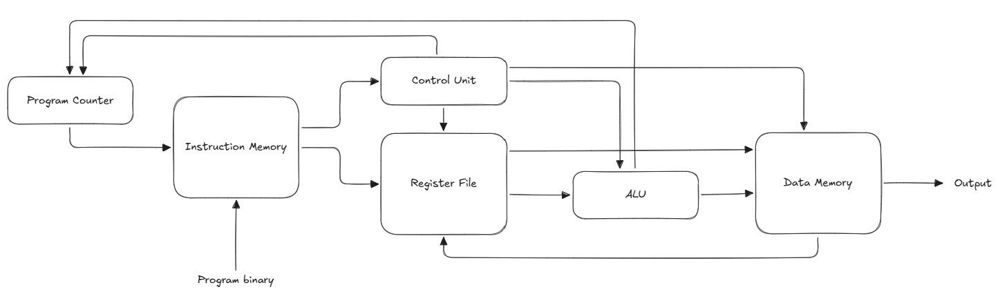
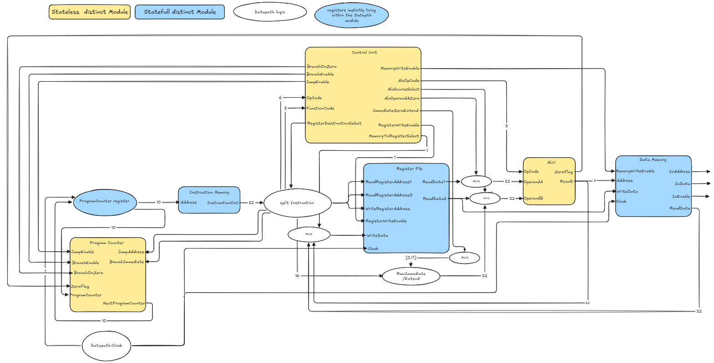
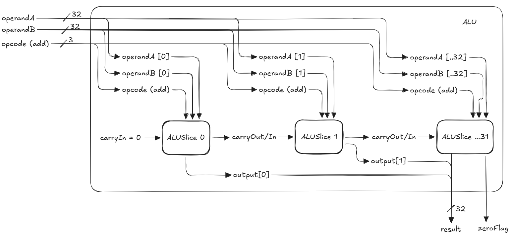
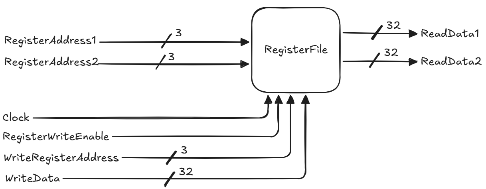
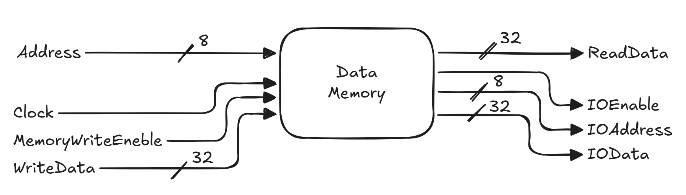
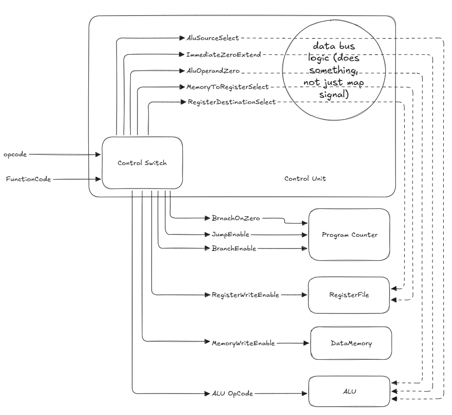
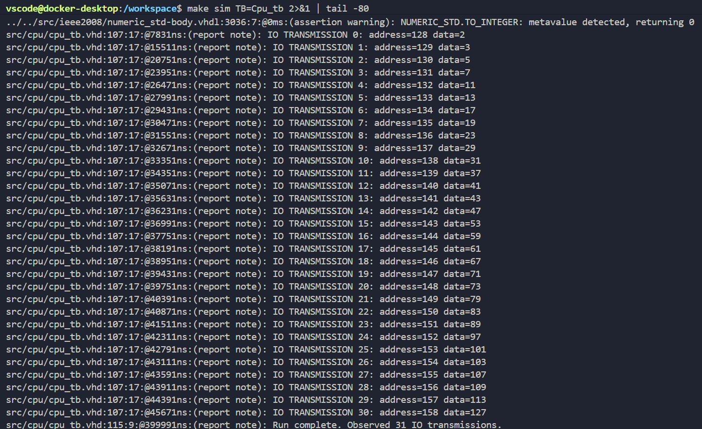

## Core ideas

- **Single-cycle CPU** Executes each instruction (fetch, decode, execute, store) in a single clock cycle.
- **Harvard architecture** Data and instructions are stored in separate memory units, which makes it much simpler to access both within a single clock cycle.
- **Instruction Set Architecture** Defines the capabilities of a CPU. The one here was derived from the provided assembly program: a subset of MIPS, simplified where the original design optimises for cost, which wasn't a concern here.
- **VHDL and FPGAs** VHDL is a hardware description language for synthesising and simulating digital circuits. The same code can be converted into a bitstream that configures an FPGA to perform the CPU's tasks.

## Approach

I used a bottom-up waterfall and test-driven development. Each component (ALU, register file, instruction memory, data memory, control unit, program counter, datapath) got a clear specification, with tests written beforehand. Whenever practical, I added **integration tests** between components. These became more useful as more components were added, catching any drift in expected behaviour when older ones were modified to fix issues.

Testbenches ran in GHDL, an open-source VHDL compiler, driven by a makefile with the exact build order. The modules also open in Vivado (set to the VHDL-2008 standard).

## How it works

### Datapath

The datapath (`cpu.vhd`) organises the rest of the modules and wires them together. Each arrow below is one or more mapped ports (bit flags, data buses) that trigger behaviour in the receiving module.



*High-level CPU datapath.*



*Detailed view of the datapath and the other modules' terminals.*

### Arithmetic logic unit

The ALU is split into 32 **bit slices**, each performing the same set of operations on one pair of bits: addition, subtraction, AND, OR, XOR, NOT, and shift. The inputs are split into bits and passed to the corresponding slice along with the opcode; the result is reassembled from their outputs, with carries chained between slices. Inside a slice, each bit is temporarily widened to two bits so arithmetic never loses its carry.

```vhdl
BitSlices: for BitIndex in 0 to 31 generate
    BitSlice: ALUBitSlice
        port map (
            Opcode   => OpCode,
            InputA   => EffectiveOperandA(BitIndex),
            InputB   => OperandB(BitIndex),
            CarryIn  => CarryChain(BitIndex),
            Output   => ResultInternal(BitIndex),
            CarryOut => CarryChain(BitIndex + 1)
        );
end generate;
```

A few extra pieces of logic pre-process the operands: the carry is pre-set to 1 so subtraction can run as `A + (not B) + 1`, shifts pass pre-shifted bit positions to the slices, and an `AluOperandAZero` flag lets immediate values be loaded into a register through the ALU instead of adding a third input to the register file.



*ALU high-level workings.*

### Register file

Sixteen 32-bit registers, initialised to zero. Two registers can be read at any time without a clock; writes happen on the rising clock edge when `RegisterWriteEnable` is set. Hard-setting zeros as the starting state turned out to cause far fewer crashes than leaving it uninitialised, especially once components were wired together.



*Register file block diagram with its input/output ports.*

### Instruction memory and loader

Instruction memory holds the program as a sequence of 32-bit instructions. Instead of hardcoding programs into VHDL, an **assembler** converts assembly into a binary file, and a **loader** package reads it and passes the instructions into memory when a testbench instantiates the CPU. The rest of memory is filled with `nop`s, so every bit is known at all times.

### Data memory and I/O

Data memory stores the data the program operates on, and doubles as the point where the CPU talks to the outside world: the address's most significant bit marks I/O. Writes there aren't stored; they raise `IoEnable`, signalling to any listener that new data is coming. The testbench listens for it and reports each value the program outputs.



*Data memory block diagram.*

### Control unit

The control unit decodes the instruction's opcode and sets the other components into the right operational state. It's a stateless switch from opcode to signals; several of those signals return to the datapath and change how it treats the instruction, mostly because register input has to pass through the ALU.



*Control unit components, and its explicitly and implicitly sent signals.*

### Program counter

The program counter points to the next instruction. It's not just +1 each cycle: loops and if statements need jumps by an offset, or to a specific address. All three targets (next, next with offset, jump) are computed every cycle, and the control flags pick one.

```vhdl
NextProgramCounter <= JumpAddress when JumpEnable = '1'
    else std_logic_vector(BranchTargetProgramCounter(9 downto 0)) when BranchTaken = '1'
    else std_logic_vector(SequentialProgramCounter(9 downto 0));
```

## Challenges

- **Carry** The ALU carry was very challenging to get right. The final version stores carries at a higher level of abstraction; the ripple logic could probably live inside the slices themselves.
- **Zero state** I didn't consider a predefined zero state at first. The first error appeared when integrating the ALU with instruction memory, and the compiler's errors were very hard to track down. Testing modules together early paid off.
- **Test programs** Early integration tests used hand-wired instructions, which became hard to verify as tests grew. Writing a loader and assembler also showed the design wasn't overfitted to one program. In hindsight, the assembler was mostly wasted effort: an off-the-shelf MIPS compiler, configured for the modified ISA, could have done the job.

## Outcome

The CPU runs the Sieve of Eratosthenes and outputs the primes it finds through its I/O interface.



*Testbench output: the CPU reports each prime it finds, from 2 to 127.*
